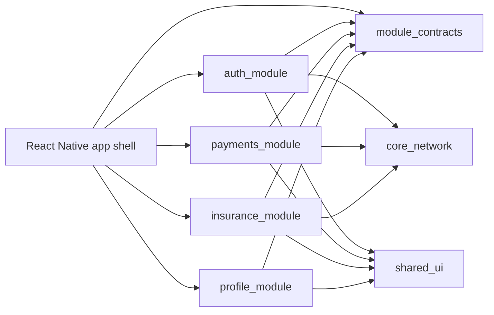

# MobileMicroappsArchitecture

A React Native reference app showing how to structure a large mobile product with microapps, shared packages and clean module boundaries.

The project mirrors the Flutter architecture demo in this workspace, but uses plain React Native + TypeScript without adding external navigation or state libraries.

## Repository shape

```text
App.tsx
src/
  app_shell/
    AppSessionController.ts
    CompositionRoot.ts
    MicroappsDemoApp.tsx
    MicroappsShell.tsx
  packages/
    auth_module/
    payments_module/
    insurance_module/
    profile_module/
    shared_ui/
    core_network/
    module_contracts/
docs/
  architecture-react-native.md
```

## What it demonstrates

| Area | Implementation |
| --- | --- |
| Shell principal | `src/app_shell/MicroappsShell.tsx` owns navigation and mounts selected module routes. |
| Composition root | `src/app_shell/CompositionRoot.ts` wires shared session/network dependencies. |
| Module registry | `src/packages/module_contracts` defines `MicroAppModule`, `MicroAppRoute` and `ModuleRegistry`. |
| Contracts between modules | `SessionContract` lets Profile and Payments read identity without importing Auth internals. |
| Shared dependencies | `core_network` exposes a fake enterprise gateway behind `NetworkClient`. |
| Design system | `shared_ui` centralizes colors, cards, metrics, status pills and page layout. |
| Transactional feature | `payments_module` owns a transfer flow and submits through `core_network`. |

## Architecture diagram



## Run

Use the normal React Native commands after dependencies are installed:

```bash
npm start
npm run android
```

The demo code does not require any additional navigation or state-management package.
