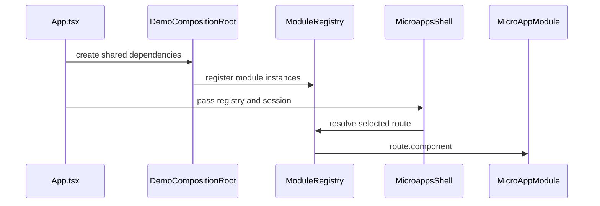
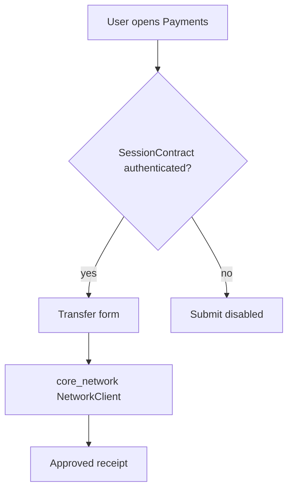

# React Native Microapps Architecture

## Composition model

The shell is the only place that knows every module. Modules expose route metadata and a screen component through `MicroAppModule`.



## Dependency rules

```text
Allowed:
  app_shell -> feature modules
  feature modules -> module_contracts
  feature modules -> shared_ui
  feature modules -> core_network when API access is needed

Avoid:
  payments_module -> auth_module
  profile_module -> auth_module
  insurance_module -> payments_module
  shared_ui -> feature modules
  core_network -> feature modules
```

## Package responsibilities

- `module_contracts`: stable interfaces for modules, routes, registry and session.
- `core_network`: shared network boundary. The demo uses `FakeEnterpriseGateway`.
- `shared_ui`: reusable design primitives.
- `auth_module`: owns session entry points.
- `payments_module`: owns the transfer flow.
- `insurance_module`: owns quote logic.
- `profile_module`: reads identity through `SessionContract`.

## Transactional feature flow



Payments never imports Auth. It only reads the session through the shared contract.
