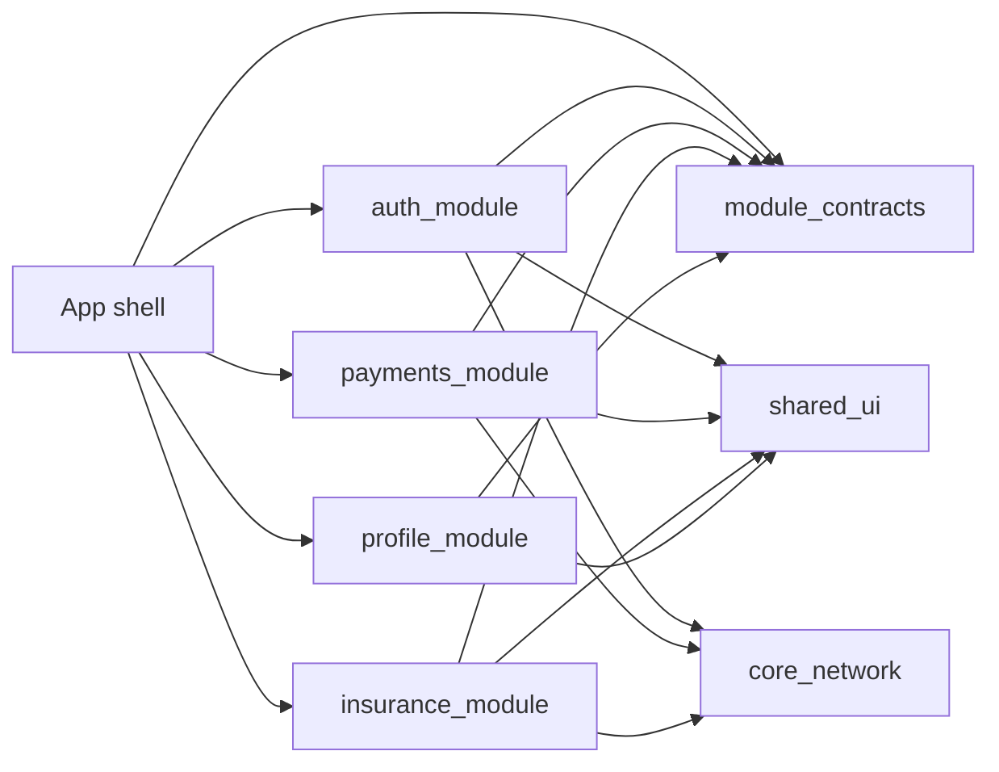

# mobile_microapps_architecture

Reference repository for mobile microapps architecture, with two equivalent implementations:

- **Flutter**: `mobile_microapps_architecture_flutter/`
- **React Native**: `MobileMicroappsArchitecture/`

The goal is to show how a large mobile app can be organized around independent microapps, shared platform packages and explicit contracts between modules.

## Why this repo exists

Most mobile examples show feature folders inside one app. This repository goes one step further and demonstrates a modular architecture closer to enterprise mobile systems:

- an app shell that owns composition and navigation
- independent feature modules for Auth, Payments, Insurance and Profile
- shared contracts so modules do not import each other directly
- shared UI/design-system primitives
- shared network boundary
- a transactional feature example in Payments
- architecture documentation with diagrams

## Repository structure

```text
mobile_microapps_architecture/
  README.md

  mobile_microapps_architecture_flutter/
    lib/
      app_shell/
    packages/
      auth_module/
      payments_module/
      insurance_module/
      profile_module/
      shared_ui/
      core_network/
      module_contracts/
    docs/
      architecture.md

  MobileMicroappsArchitecture/
    App.tsx
    src/
      app_shell/
      packages/
        auth_module/
        payments_module/
        insurance_module/
        profile_module/
        shared_ui/
        core_network/
        module_contracts/
    docs/
      architecture-react-native.md
```

## Architecture at a glance



## Shared concepts

| Concept | Flutter | React Native |
| --- | --- | --- |
| App shell | `lib/app_shell/` | `src/app_shell/` |
| Module contract | `packages/module_contracts` | `src/packages/module_contracts` |
| Shared UI | `packages/shared_ui` | `src/packages/shared_ui` |
| Network boundary | `packages/core_network` | `src/packages/core_network` |
| Auth module | `packages/auth_module` | `src/packages/auth_module` |
| Payments module | `packages/payments_module` | `src/packages/payments_module` |
| Insurance module | `packages/insurance_module` | `src/packages/insurance_module` |
| Profile module | `packages/profile_module` | `src/packages/profile_module` |

## Dependency rule

The shell may know all modules, but modules should not know each other.

```text
Allowed:
  app_shell -> feature modules
  feature modules -> module_contracts
  feature modules -> shared_ui
  feature modules -> core_network when API access is needed

Avoid:
  payments_module -> auth_module
  profile_module -> auth_module
  insurance_module -> payments_module
  shared_ui -> feature modules
  core_network -> feature modules
```

## Flutter demo

Open:

```text
mobile_microapps_architecture_flutter/
```

Read:

- `mobile_microapps_architecture_flutter/README.md`
- `mobile_microapps_architecture_flutter/docs/architecture.md`

Run from that folder:

```bash
flutter pub get
flutter run
```

## React Native demo

Open:

```text
MobileMicroappsArchitecture/
```

Read:

- `MobileMicroappsArchitecture/README.md`
- `MobileMicroappsArchitecture/docs/architecture-react-native.md`

Run from that folder:

```bash
npm install
npm start
npm run android
```

## What to look for

Start with each `CompositionRoot`. That file shows the most important idea in the repo: shared services are created once, injected into independent modules and registered in the shell.

Then compare the Payments module in both implementations. It owns a transactional flow, but it reads authentication state only through `SessionContract`. That is the boundary this repo is trying to make clear.

## README pitch

A mobile microapps architecture reference built with Flutter and React Native, showing how to structure large-scale apps using independent modules, shared packages and clean boundaries.
