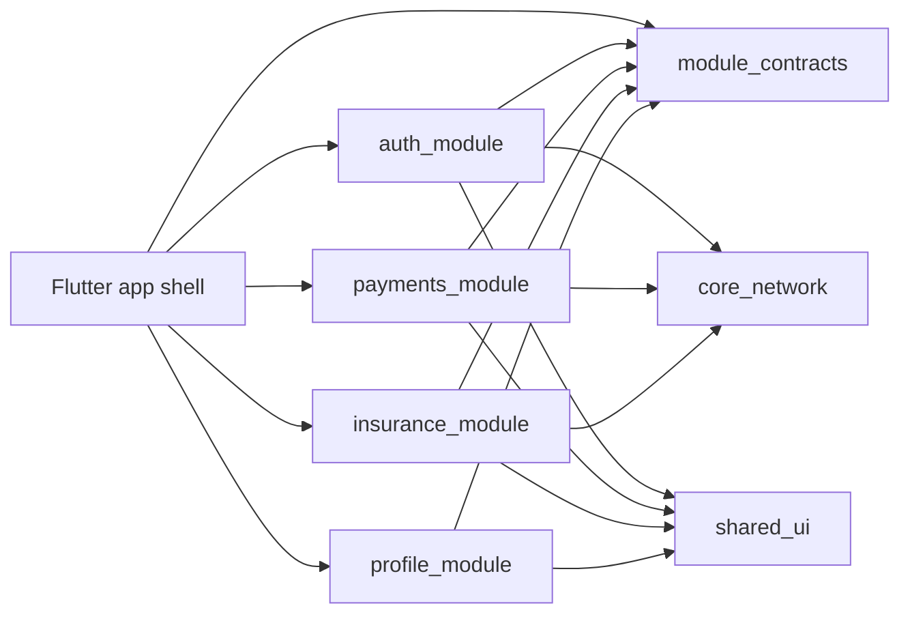

# mobile_microapps_architecture

A mobile microapps architecture reference built with Flutter, showing how to structure large-scale apps using independent modules, shared packages and clean boundaries.

This repo is intentionally small enough to read in one pass, but it demonstrates the same composition ideas used in enterprise mobile apps:

- app shell owns composition, navigation and dependency wiring
- modules expose routes through contracts instead of importing each other
- shared UI and network packages are reusable platform capabilities
- transactional features stay inside their bounded module
- documentation includes architecture diagrams and package responsibilities

## Repository shape

```text
lib/
  main.dart
  app_shell/
    app_session_controller.dart
    composition_root.dart
    microapps_demo_app.dart
    microapps_shell.dart
packages/
  auth_module/
  payments_module/
  insurance_module/
  profile_module/
  shared_ui/
  core_network/
  module_contracts/
docs/
  architecture.md
```

## What the demo shows

| Area | Implementation |
| --- | --- |
| Shell principal | `lib/app_shell/microapps_shell.dart` mounts module routes and renders desktop/mobile navigation. |
| Module registry | `packages/module_contracts` defines `MicroAppModule`, `MicroAppRoute` and `ModuleRegistry`. |
| Shared contracts | `SessionContract` lets Profile and Payments consume identity without importing Auth internals. |
| Shared dependencies | `core_network` provides a fake enterprise gateway behind `NetworkClient`. |
| Design system | `shared_ui` centralizes theme, cards, metrics and status primitives. |
| Transactional feature | `payments_module` owns a transfer flow and submits through `core_network`. |

## Architecture diagram



## Run

```bash
flutter pub get
flutter run
```

## Why this is useful

Most Flutter samples stop at feature folders inside one app package. This reference demonstrates a stronger boundary: each microapp is a local package with its own public API, dependencies and route ownership. The shell becomes a composition layer, not a dumping ground for feature logic.

For the deeper package contract notes, see [docs/architecture.md](docs/architecture.md).
