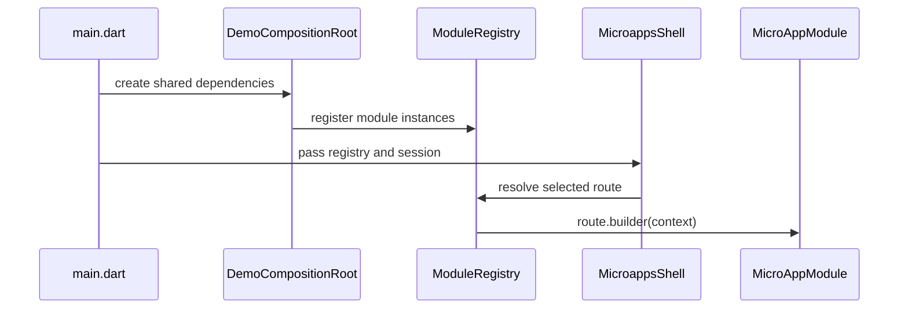
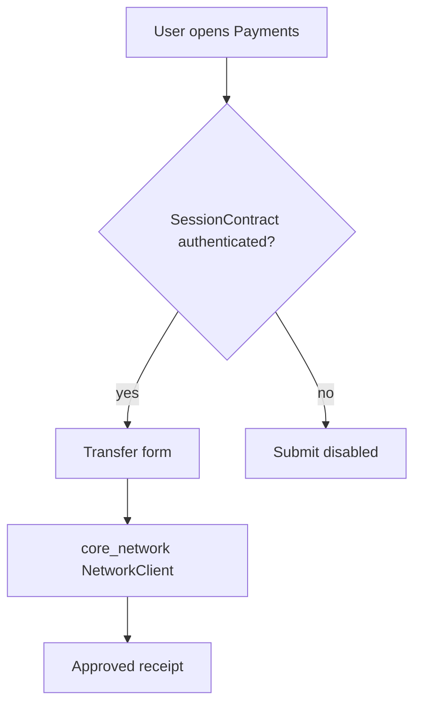

# Architecture

## Composition model

The app shell is the only layer that knows all modules. It creates shared platform services in `DemoCompositionRoot`, injects them into every module and registers each module in `ModuleRegistry`.



## Dependency rules

```text
Allowed:
  app_shell -> feature modules
  feature modules -> module_contracts
  feature modules -> shared_ui
  feature modules -> core_network when they need API access

Avoid:
  payments_module -> auth_module
  profile_module -> auth_module
  insurance_module -> payments_module
  shared_ui -> feature modules
  core_network -> feature modules
```

## Package responsibilities

### module_contracts

Defines stable interfaces shared by the shell and modules:

- `MicroAppModule`
- `MicroAppRoute`
- `ModuleRegistry`
- `SessionContract`

This package is intentionally thin. It should describe contracts, not business logic.

### core_network

Owns the network boundary. In this demo it uses `FakeEnterpriseGateway`, but real apps can replace it with Dio, Chopper, GraphQL, REST clients or platform-specific networking without changing module route contracts.

### shared_ui

Owns design tokens and reusable visual primitives. Modules can use shared cards, metric tiles and status pills without duplicating styling.

### feature modules

Each module owns its public module class plus internal screens:

- `AuthModule` owns session entry points.
- `PaymentsModule` owns the transactional transfer flow.
- `InsuranceModule` owns quote logic.
- `ProfileModule` reads identity from the session contract.

## Transactional feature flow



The important boundary is that Payments does not know how Auth stores identity. It only reads `SessionContract`.
